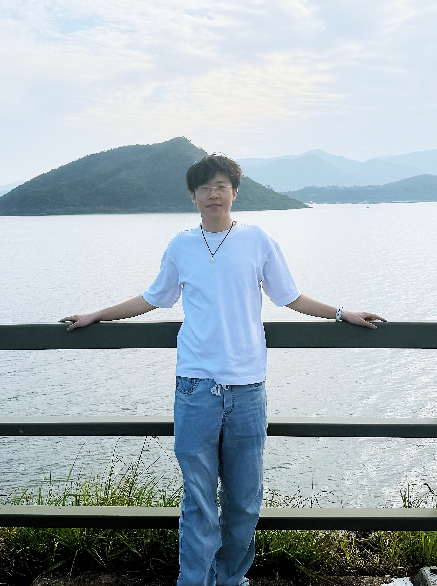

# Jianqiang Li (李建强)

I am a Ph.D. student from the NetX Lab, Department of Computer Science and Engineering, The Chinese University of Hong Kong (CUHK), supervised by [Prof. Hong Xu, Henry](https://henryhxu.github.io/index.html).

I received my B.Sc. in Computer Science in 2024 from CUHK.

My research interest is **Machine Learning for Network Management**, with a specific focus on **intent-based networking**.

[Email](mailto:jqli1@cse.cuhk.edu.hk) / [GitHub](https://github.com/JackonLI)

 

## 🔬 Research Interests

- Machine Learning for Network Management
- Intent-based Networking
- Computer Networks and Systems
- Applied Large Language Models (LLMs)

## 📚 Publications

- **Automating Conflict-Aware ACL Configurations with Natural Language Intents**  
  *Wenlong Ding, **Jianqiang Li**, Zhixiong Niu, Huangxun Chen, Yongqiang Xiong, and Hong Xu*  
  arXiv preprint arXiv:2508.17990, 2025.  

- **Automating Network Configuration with Natural Language Intents**  
  *Wenlong Ding, **Jianqiang Li**, Zhixiong Niu, Huangxun Chen, and Hong Xu*  
  ACM SIGCOMM 2024 Posters and Demos, 2024. [[DOI]](https://doi.org/10.1145/3672202.3673721)

## 🎓 Education

- **Ph.D. in Computer Science and Engineering** *(08/2024 – Present)*  
  The Chinese University of Hong Kong  

- **B.Sc. in Computer Science** *(08/2020 – 07/2024)*  
  The Chinese University of Hong Kong  

## 💼 Experience

- **Graduate Teaching Assistant**, CUHK
  - CSCI3320 Fundamentals of Machine Learning (Spring 2025)
  - CSCI3150 Introduction to Operating Systems (Fall 2024)

- **Undergraduate Summer Research Internship**, CUHK *(Summer 2023)*  
  Topic: Automated Network Configuration  
  *Supervisor: Prof. XU, Hong & Mr. DING, Wenlong*

- **Undergraduate Summer Research Internship**, CUHK *(Summer 2021)*  
  Topic: Reinforcement Learning for Autonomous Systems  
  *Supervisor: Dr. HAN, Dongkun & Mr. HUANG, Hejun*

## 🏆 Awards

- **Dean’s List, Faculty of Engineering**, CUHK (2021, 2022, 2023)
- **Annual Scholarship for Elite Stream**, CSE Department, CUHK (2021, 2022, 2023, 2024)
- **Annual Scholarships Academic**, S.H. Ho College, CUHK (12/2021)
- **Honours at Entrance**, CUHK (10/2020)
